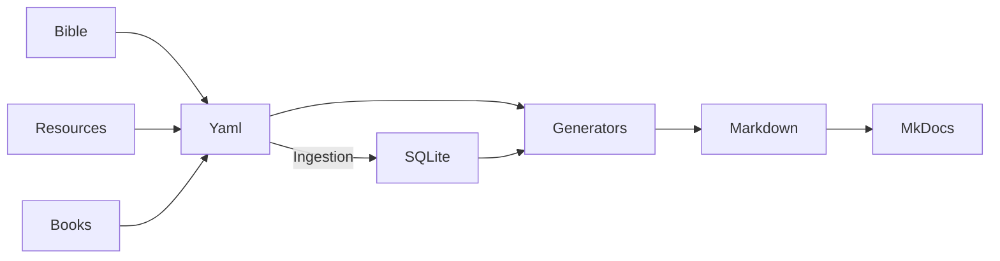

# Contributing to Bible Atlas

Thank you for your interest in contributing! Bible Atlas is a collaborative project to map biblical figures, tribes, places, and themes. Contributions follow a clear workflow to ensure data integrity.

## How to Contribute

1. **Clone or fork the repo**
```sh
git clone https://github.com/whitetreelexicon/bible-atlas.git
cd bible-atlas
```

2. **Install dependencies**
If you don't have it, [install UV first](https://docs.astral.sh/uv/getting-started/installation/)
```sh
uv install
source .venv/bin/activate
```

3. **Serve the web**
```sh
mkdocs serve
```

4. **Deploy the web**
```sh
mkdocs gh-deploy
```
- This will build the static site and push it to the gh-pages branch where Github Pages is serving.

5. **Submit a Pull Request:**
- Make sure all YAML is validated (see scripts/validate_yaml.py).
- PR should include new nodes or updates; generated Markdown will be reviewed automatically.


## Workflow




