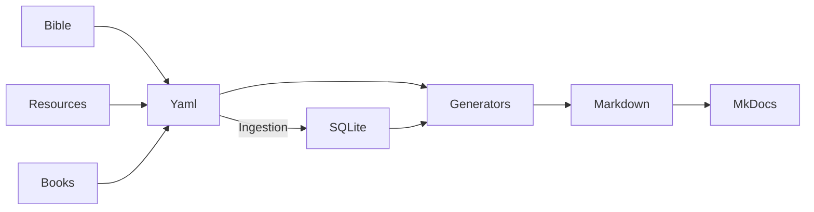

# Contributing to White Tree Bible Connections

Thank you for your interest in contributing! Bible Atlas is a collaborative project to map biblical figures, tribes, places, and themes. Contributions follow a clear workflow to ensure data integrity.

## How to Contribute

1. **Clone or fork the repo**
```sh
git clone https://github.com/whitetreebible/connections.git
cd connections
```

2. **Install dependencies**
If you don't have it, [install UV first](https://docs.astral.sh/uv/getting-started/installation/)
```sh
uv sync
source .venv/bin/activate
```

3. **Serve the web**
```sh
make import_yaml
mkdocs serve
```

4. **Submit a Pull Request:**
- Make sure all YAML is validated (see scripts/validate_yaml.py).[^validate]
- PR should include new nodes or updates; generated Markdown will be reviewed automatically.


## Workflow



[^validate]: Doesn't exist yet, but someday it will.
