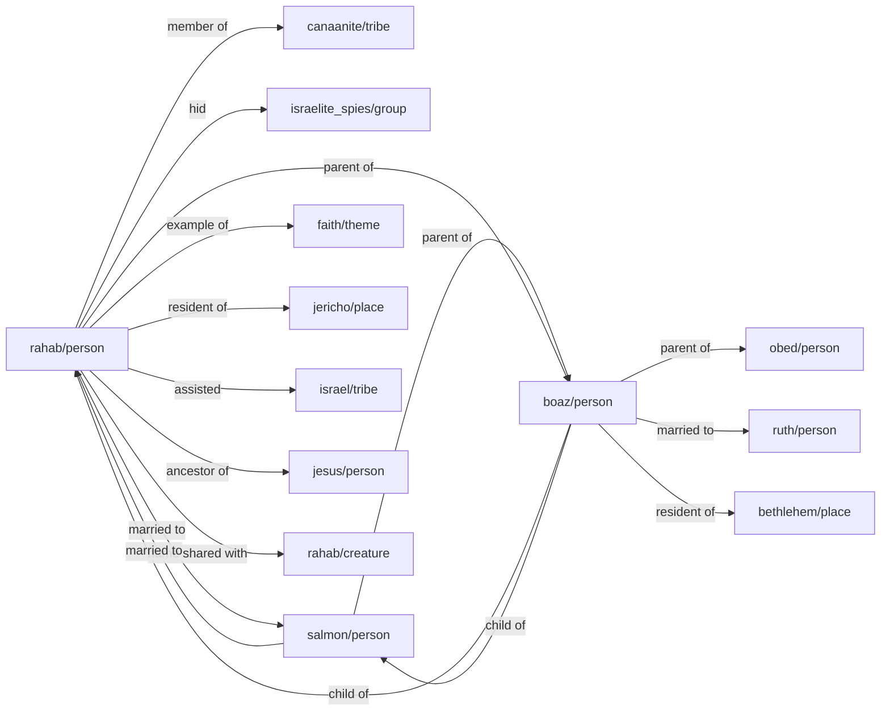

# Boaz
## Boaz (son of Salmon and Rahab)
Boaz was a wealthy landowner in [place/bethlehem](../../place/bethlehem/) and a prominent figure in the Book of Ruth. He is the son of Salmon and Rahab, and becomes the husband of [person/ruth](../../person/ruth/). Boaz is the great-grandfather of King [person/david](../../person/david/) and is mentioned in the genealogy of [person/jesus](../../person/jesus/) in [Matthew 1:5-6](https://biblehub.com/context/matthew/1.htm){:target="_blank"}.

## Associations
- **Child of** [Salmon](../../person/salmon/)
- **Child of** [Rahab](../../person/rahab/)
- **Married to** [person/ruth](../../person/ruth/)
- **Parent of** [person/obed](../../person/obed/)
- **Resident of** [place/bethlehem](../../place/bethlehem/)

## All connections
