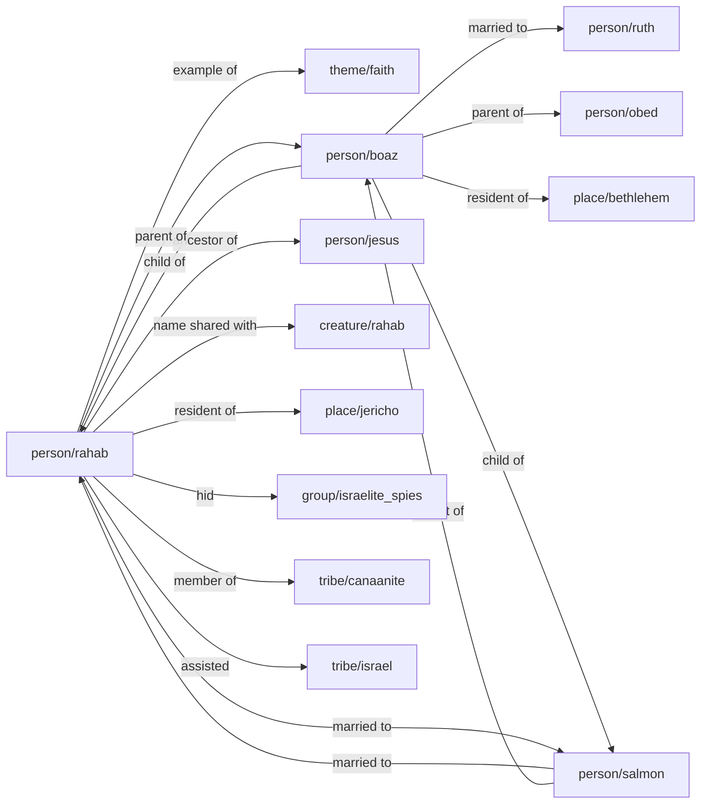

# Rahab
## Rahab the Prostitute
Rahab was a [tribe/canaan](../../tribe/canaan/) woman in [place/jericho](../../place/jericho/) who hid the [tribe/israel](../../tribe/israel/) spies sent by [person/joshua](../../person/joshua/). 
Because of her actions, she and her family were spared during the conquest of the city.[^test_footnote]
She is later mentioned in the genealogy of Jesus in [Matthew 1:5](https://biblehub.com/context/matthew/1-5.htm){:target="_blank"} and praised for her faith in [Hebrews 11:31](https://biblehub.com/context/hebrews/11-31.htm){:target="_blank"}. 
Scholars note that she should not be confused with the [creature/rahab_monster](../../creature/rahab_monster/) mentioned in [Psalm 89:10](https://biblehub.com/context/psalms/89-10.htm){:target="_blank"} and [Job 26:12](https://biblehub.com/context/job/26-12.htm){:target="_blank"}.
Rahab's story bridges the Old and New Testaments. Some extra-biblical sources, like Josephus[^josephus_note_1], recount her story in a similar way to [Joshua 2](https://biblehub.com/context/joshua/2.htm){:target="_blank"}.
Her inclusion among women in Jesus' genealogy is notable and discussed in multiple commentaries. Scholarly debate exists on the historical versus symbolic elements of her story.

## Associations
- **Resident of** [place/jericho](../../place/jericho/)
- **Member of** [tribe/canaanite](../../tribe/canaanite/)
- **Assisted** [tribe/israel](../../tribe/israel/)
- **Name shared with** [creature/rahab](../../creature/rahab/)
- **Ancestor of** [person/jesus](../../person/jesus/)
- **Example of** [theme/faith](../../theme/faith/)
- **Hid** [group/israelite_spies](../../group/israelite_spies/)
- **Married to** [Salmon](../../person/salmon/)
- **Parent of** [Boaz](../../person/boaz/)

## All connections

[^test_footnote]: This is a test footnote for demonstration purposes, it has a [person/jesus](../../person/jesus/) link and a [Joshua 2](https://biblehub.com/context/joshua/2.htm){:target="_blank"} link.
[^josephus_note_1]: 'Josephus recounts Rahab hiding the spies and her family's preservation during Jericho's conquest.' (Josephus, Flavius, *Antiquities of the Jews*, Book 5, Section 1.)
