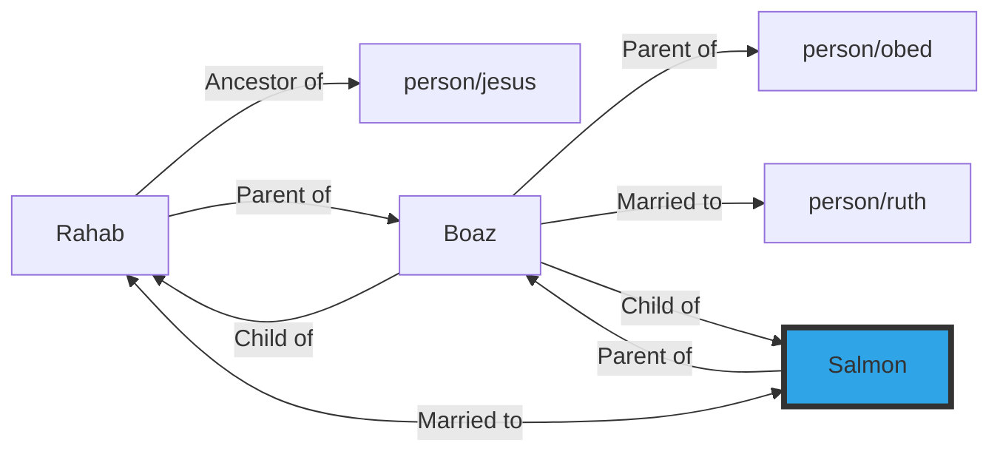
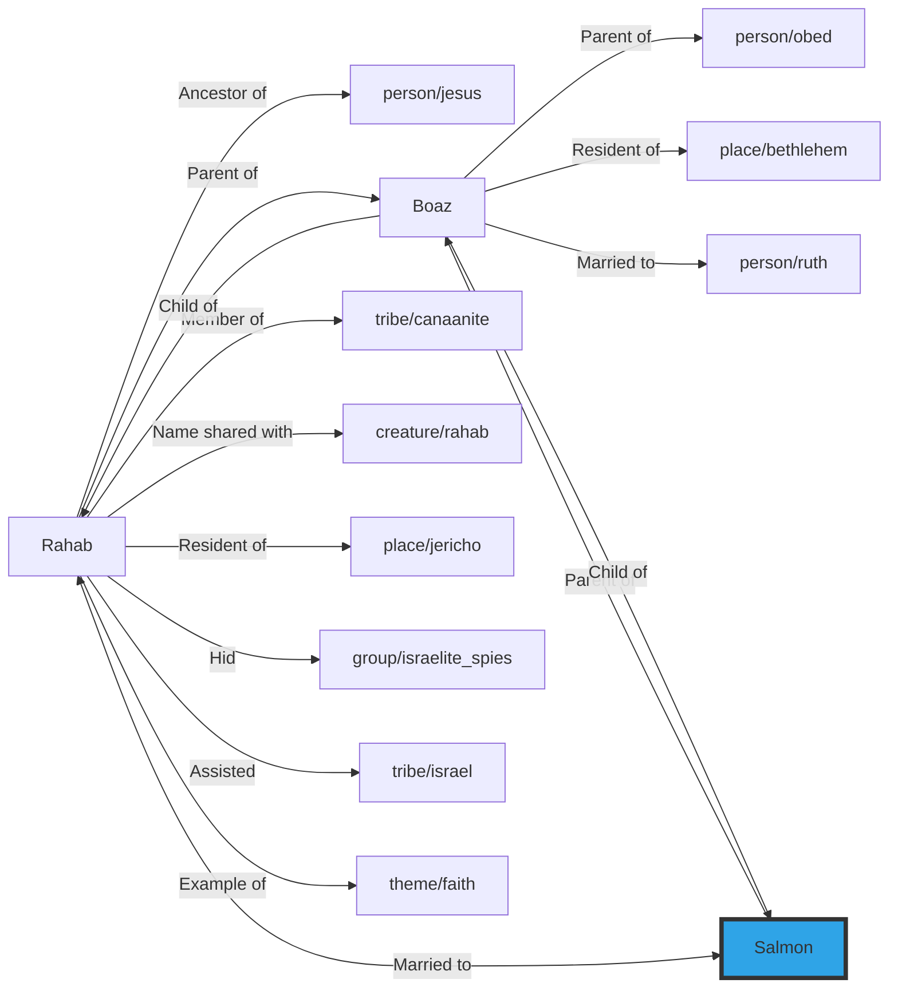

# Salmon
## Salmon (husband of Rahab)
Salmon was a member of the tribe of [tribe/judah](../../tribe/judah/) and is noted in biblical genealogies as the husband of [Rahab](../../person/rahab/) and the father of [Boaz](../../person/boaz/). He is mentioned in the genealogy of [person/jesus](../../person/jesus/) in [Matthew 1:4-5](https://biblehub.com/context/matthew/1.htm){:target="_blank"}.
Little else is known about Salmon, but his marriage to Rahab is significant in the biblical narrative, linking the story of the conquest of Jericho to the lineage of King David and Jesus.

## Associations
- **Married to** [Rahab](../../person/rahab/)
- **Parent of** [Boaz](../../person/boaz/)

## Family connections

## All connections
