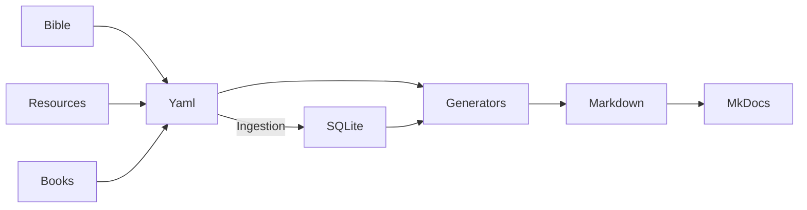

# Contributing

Thank you for your interest in contributing! Connections is a collaborative project to map biblical figures, tribes, places, and themes. Contributions follow a clear workflow to ensure data integrity.

## Financial Contributors

Someday, I would love to spend more than a few hours here or there on nights and weekends contributing to this project, but my day-job is still a big part of my life. Once I setup a way to donate, I'll have a way to track if this is a project that can be supported by my full-time work. I'll keep you posted.

## Academic Contributors
As a Bible enthusiast, I hope that others who love to study the Bible want to contribute to this (rather large) potential body of work! I welcome emails and 

## Software Dev Contributors

We welcome contributions! To add new pages or update connections:  

1. Create or modify YAML files in the `data/` folder.  
2. Run the **build script** to generate updated Markdown pages.  
3. Submit a pull request to the repository for review.

For more details, see out [contribution guidelines](devs/contributing.md)

1. **Clone or fork the repo**
```sh
git clone https://github.com/whitetreebible/connections.git
cd connections
```

2. **Install dependencies**
If you don't have it, [install UV first](https://docs.astral.sh/uv/getting-started/installation/)
```sh
source .venv/bin/activate
```

3. **Serve the web**
```sh
tom yaml
tom serve
```

4. **Submit a Pull Request:**
- Make sure all YAML is validated (see scripts/validate_yaml.py).[^validate]
- PR should include new nodes or updates; generated Markdown will be reviewed automatically.

5. **Deploy the web**
```sh
tom deploy
```
- This will build the static site and push it to the gh-pages branch where Github Pages is serving.


## Workflow



[^validate]: Doesn't exist yet, but someday it will.
